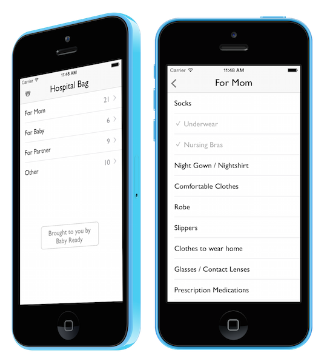

# Hospital Bag

Simple app to track what to pack for the hospital when you are pregnant.

https://itunes.apple.com/app/hospital-bag-packing-list/id1001274742 

# Libraries

- [FMDB](https://github.com/ccgus/fmdb) 
- [KLCPopup](https://github.com/jmascia/KLCPopup)
- [SloppySwiper](https://github.com/fastred/SloppySwiper) 
- [SVProgressHUD](https://github.com/TransitApp/SVProgressHUD) 

# Design

- App Icon: [Rohan Gupta](https://thenounproject.com/term/luggage/40180/)

# Contact

- https://github.com/dkhamsing
- https://twitter.com/dkhamsing

# License

Hospital Bag is available under the MIT license. See the LICENSE file for more info.